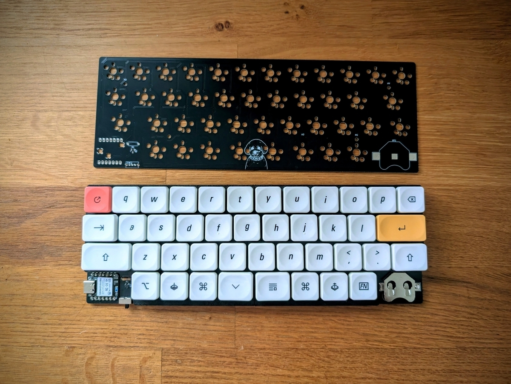

## zmk-config-kan42row

For pairing and connection instructions in Japanese, see [README_PAIRING_JA.md](./README_PAIRING_JA.md).

This is a 42-key low-profile wireless keyboard powered by a CR2032 coin cell instead of a LiPo battery, designed for safety and ease of maintenance.
It uses the XIAO nRF52840 MCU and ZMK firmware, both known for their low power consumption.

## Specifications

Specifications

- Key switches: Kailh Choc V2 Deep Sea Silent Mini
- Keycaps: JezailFunder LCK keycap set
- MCU: XIAO nRF52840
- Number of keys: 42
- Power supply: CR2032 (coin cell)
- Weight: 195 g (with case) / 152 g (without case)

One caution: connecting USB power while a CR2032 is installed can cause reverse voltage and potentially make the battery explode.
I added a Pch MOSFET (based on advice from ChatGPT) to prevent this, but my circuit still shows reverse voltage when tested — likely a design error.
Since I rarely use the USB port, I plan to seal it in the case and use the keyboard exclusively in wireless mode.

Please refer to [this Japanese blog post](https://nwpct1.hatenablog.com/entry/custom-keyboard-cr2032) for details about this keyboard.

## BOM

The total cost is approximately under 6,000 yen without keycaps, or around 12,000 yen if you purchase the same keycaps I used.

| Item                              | Quantity | Link                                                                                                                                                                                       | Price (approx.) |
| --------------------------------- | -------- | ------------------------------------------------------------------------------------------------------------------------------------------------------------------------------------------ | --------------- |
| XIAO nRF52840                     | 1        | [Akizuki Denshi](https://akizukidenshi.com/catalog/g/g117341/)                                                                                                                             | 1,940 yen       |
| 1N4148W diode                     | 42 pcs   | [Akizuki Denshi](https://akizukidenshi.com/catalog/g/g116985/)                                                                                                                             | 320 yen         |
| Choc v2 socket                    | 42 pcs   | [AliExpress](https://ja.aliexpress.com/item/1005007225352311.html)                                                                                                                         | 445 yen         |
| Kailh Deep Sea Silent Mini switch | 42 pcs   | [AliExpress](https://ja.aliexpress.com/item/1005009290242541.html)                                                                                                                         | 2,900 yen       |
| Choc v2 keycap                    | 42 pcs   | [Jezail Funder](https://jezailfunder.jp/products/lck-%E3%82%BF%E3%82%A4%E3%83%A0-%E3%82%AD%E3%83%BC%E3%82%AD%E3%83%A3%E3%83%83%E3%83%97%E3%82%BB%E3%83%83%E3%83%88?variant=51852456788275) | 5,720 yen       |
| *(optional)* Pch MOSFET SSM3J332R | 1        | [Akizuki Denshi](https://akizukidenshi.com/catalog/g/g115985/)                                                                                                                             | 120 yen         |
| *(optional)* CR2032 holder        | 1        | [Akizuki Denshi](https://akizukidenshi.com/catalog/g/g106925/)                                                                                                                             | 50 yen          |
| *(optional)* 10 kΩ resistor       | 1        | —                                                                                                                                                                                          | —               |
